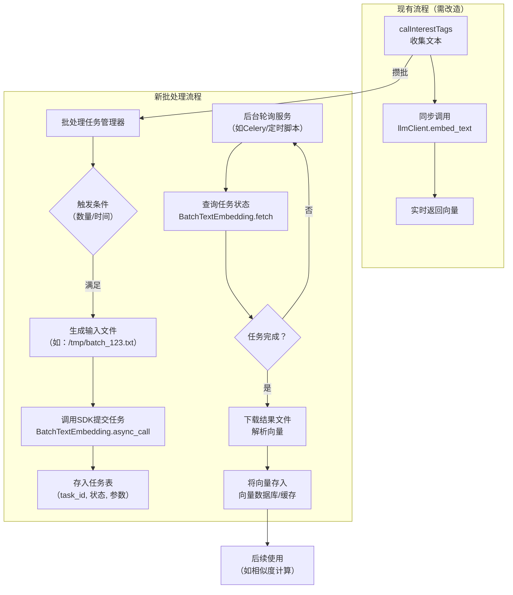

# 1 批处理向量化

> 问题：阿里云官方也提供了批处理接口（https://bailian.console.aliyun.com/cn-beijing/?spm=5176.29597918.J_SEsSjsNv72yRuRFS2VknO.2.5d00133ckc2ZO5&tab=api#/api/?type=model&url=2712516）。
> 如果使用官方接口，现有代码该如何改动？

要使用阿里云的官方批处理接口，你不需要完全推翻现有代码，而是可以将当前的同步调用方式重构为**异步批处理任务**。这样可以充分利用其处理海量文本的能力，并避开限流。

### 📝 核心改动思路

现有代码（`llmClient.py`）是**同步、逐条**调用，而官方批处理接口是**异步、文件级**的。因此，改造的核心在于：

1.  **将“逐条请求”变为“攒批文件”**：`interestTag.py`不再直接调用`embed_text`，而是把需要向量化的文本先收集起来。
2.  **将“实时调用”变为“异步任务”**：攒到一定量后，生成一个文本文件，通过SDK或HTTP接口提交一个批处理任务，获取一个`task_id`。
3.  **将“同步等待”变为“轮询结果”**：用一个后台服务（如定时任务）根据`task_id`轮询任务状态，任务完成后下载结果文件，解析后供后续使用。

### 🏗️ 推荐架构调整

你需要新增一个**批处理任务管理器**，并修改现有的调用流程。



### 🛠️ 关键代码示例（以Python DashScope SDK为例）

以下是在你的`llmClient.py`基础上，新增批处理功能的核心代码片段。

#### 1. **在`llmClient.py`中新增批处理函数**

```python
# src/util/llmClient.py
import time
import os
from dashscope import BatchTextEmbedding  # 需安装：pip install dashscope

class BailianEmbeddingClient:
    # ... 原有的 __init__ 等方法保持不变 ...

    def submit_batch_task(self, texts: List[str], text_type: str = "document") -> str:
        """
        提交一个批处理任务
        Args:
            texts: 需要向量化的文本列表
            text_type: 'query' 或 'document'
        Returns:
            task_id: 任务ID，用于后续查询
        """
        # 1. 将文本列表写入临时文件（一行一条）
        import tempfile
        with tempfile.NamedTemporaryFile(mode='w', suffix='.txt', encoding='utf-8', delete=False) as f:
            for t in texts:
                f.write(t + '\n')
            temp_file_path = f.name

        # 2. （可选）将文件上传到OSS或可访问的HTTP服务器，获取一个公网URL
        #    这里简化处理，假设你有一个文件托管服务
        file_url = self.upload_to_temp_storage(temp_file_path) 
        
        # 3. 使用DashScope SDK提交异步任务
        #    注意：这里使用的是 dashscope SDK，不是之前的 openai 客户端
        response = BatchTextEmbedding.async_call(
            model=BatchTextEmbedding.Models.text_embedding_async_v2, # 或 v1
            url=file_url,
            text_type=text_type
        )
        
        if response.status_code == 200:
            task_id = response.output['task_id']
            print(f"✅ 批处理任务提交成功，task_id: {task_id}")
            return task_id
        else:
            print(f"❌ 批处理任务提交失败: {response.message}")
            return None

    def get_task_result(self, task_id: str, wait: bool = True):
        """
        查询或等待批处理任务结果
        Args:
            task_id: 任务ID
            wait: 是否等待任务完成（阻塞）
        Returns:
            解析后的向量列表，顺序与输入文本一致
        """
        if wait:
            # 同步等待任务结束（内部封装了轮询逻辑）
            response = BatchTextEmbedding.wait(task_id)
        else:
            # 仅查询一次状态
            response = BatchTextEmbedding.fetch(task_id)
        
        if response.status_code == 200 and response.output.task_status == 'SUCCEEDED':
            result_url = response.output.url
            # 下载并解析结果文件（.gz压缩的jsonl）
            vectors = self.parse_result_file(result_url)
            return vectors
        else:
            print(f"❌ 任务失败或状态异常: {response}")
            return None

    def upload_to_temp_storage(self, file_path):
        """（示例）将文件上传到临时存储并返回URL"""
        # 重要: 官方接口要求输入是一个可访问的 HTTP URL
        # 你需要实现上传到 OSS 或你自己的文件服务器的逻辑
        # 如果只是测试，可以使用一些临时文件分享服务，但不推荐用于生产
        # 这里假设你有一个上传函数
        # url = upload_to_oss(file_path)
        # return url
        raise NotImplementedError("需要实现文件上传逻辑以获取公网URL")
```

#### 2. **在`interestTag.py`中修改调用逻辑**

修改`calInterestTags`函数，不再实时调用，而是将文本“攒”起来。

```python
# src/algorithm/interestTag.py
# ... 导入部分，新增一个队列或缓存 ...

# 一个简单的全局缓存，用于攒批（生产环境请使用Redis等）
_batch_text_cache = []
_batch_cache_lock = threading.Lock()

def add_to_batch(text: str, metadata: dict):
    """将需要向量化的文本加入批处理队列"""
    with _batch_cache_lock:
        _batch_text_cache.append((text, metadata))
        # 当积累到一定数量（如500条）或定时触发时，提交任务
        if len(_batch_text_cache) >= 500:
            texts_to_process = [item[0] for item in _batch_text_cache]
            metas_to_process = [item[1] for item in _batch_text_cache]
            _batch_text_cache.clear()
            # 异步提交批处理任务（不阻塞当前计算）
            threading.Thread(target=submit_and_process_batch, args=(texts_to_process, metas_to_process)).start()

def submit_and_process_batch(texts, metadatas):
    """提交批处理任务，并在完成后处理结果"""
    client = get_embedding_client()
    task_id = client.submit_batch_task(texts, text_type="query") # 这里假设是query类型
    
    if task_id:
        # 存储 task_id 与元数据的映射，供后续回调使用
        # 例如存入Redis: {task_id: {'texts': texts, 'metadatas': metadatas}}
        store_task_mapping(task_id, texts, metadatas)
        # 可以启动一个后台协程或依赖轮询服务来获取结果
    else:
        # 提交失败，降级处理（例如调用旧版matchText）
        for metadata in metadatas:
            # ... 降级逻辑 ...
            pass
```

#### 3. **创建一个独立的后台服务用于轮询任务结果**

可以创建一个新的Python脚本（如`batch_result_poller.py`），作为常驻服务或定时任务运行：

```python
# batch_result_poller.py
import time
from src.util.llmClient import get_embedding_client
from your_redis_client import get_redis_client # 假设你用Redis存储映射

def poll_for_results():
    client = get_embedding_client()
    redis_client = get_redis_client()
    
    while True:
        # 从Redis获取所有进行中的task_id
        for task_id in redis_client.smembers('processing_tasks'):
            result = client.get_task_result(task_id, wait=False)
            if result: # 任务已完成
                # 1. 从Redis获取对应的元数据
                texts, metadatas = get_task_mapping(task_id) 
                # 2. 将向量结果（result）与元数据结合，进行后续处理
                #    例如，计算相似度、更新用户画像等
                process_vectors(result, texts, metadatas)
                # 3. 清理任务记录
                redis_client.srem('processing_tasks', task_id)
                delete_task_mapping(task_id)
        time.sleep(60) # 每分钟轮询一次

if __name__ == "__main__":
    poll_for_results()
```

### ⚠️ 重要注意事项

1.  **文件存储与URL**：官方接口的输入是一个**可公网访问的HTTP文件URL**。你需要一个中间存储（如阿里云OSS）来上传并生成这些文件的临时链接。这是改造中技术复杂度最高的部分。
2.  **异步带来的复杂性**：你的核心算法`calInterestTags`将从同步计算变为“提交任务-稍后获取结果”的模式。这需要你重新设计数据流向，可能引入消息队列或任务表来管理状态。
3.  **成本与时机**：批处理适合非实时、可以等待的场景。对于用户画像这种通常可以接受一定延迟（如分钟级）的计算，是合适的。但如果你有需要实时响应的场景，仍需保留同步的降级方案。
4.  **模型选择**：根据你的需求选择`text-embedding-async-v2`（1536维）或`v1`。维度越高，精度可能越高，但存储和计算成本也越大。你的`vectorization.py`中的ES索引维度需要与此匹配。
5.  **限流与并发**：官方文档提到并发任务数限制（例如同时处理中任务不超过3个）。你的任务管理器需要实现排队和流量控制。

总的来说，这个改造能从根本上解决单条请求的效率问题，但会显著增加系统的异步处理复杂度。你需要权衡开发成本和性能收益，并仔细设计任务的生命周期管理。

如果你需要针对其中某个环节（比如如何与现有的`vectorization.py`整合结果）进行更详细的讨论，我可以提供进一步的思路。